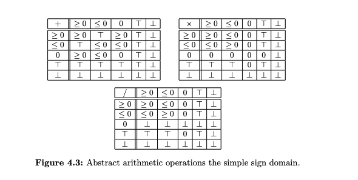
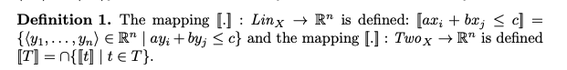
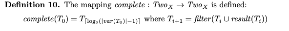
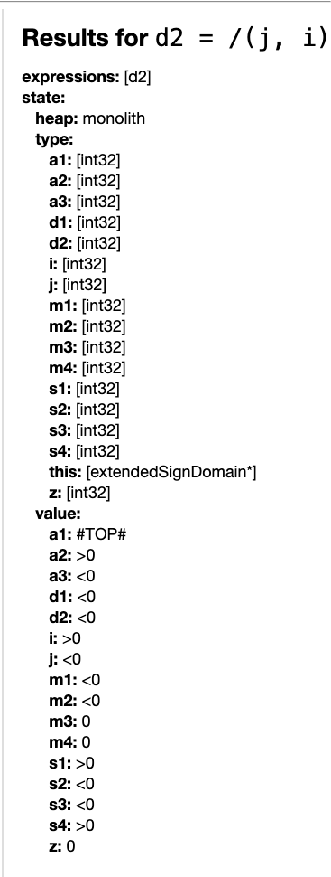
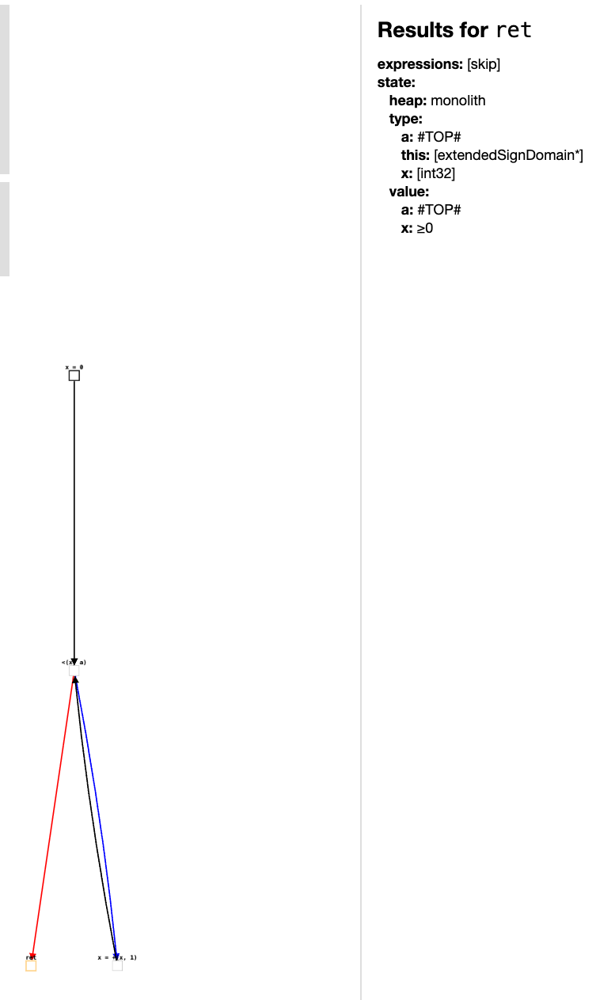
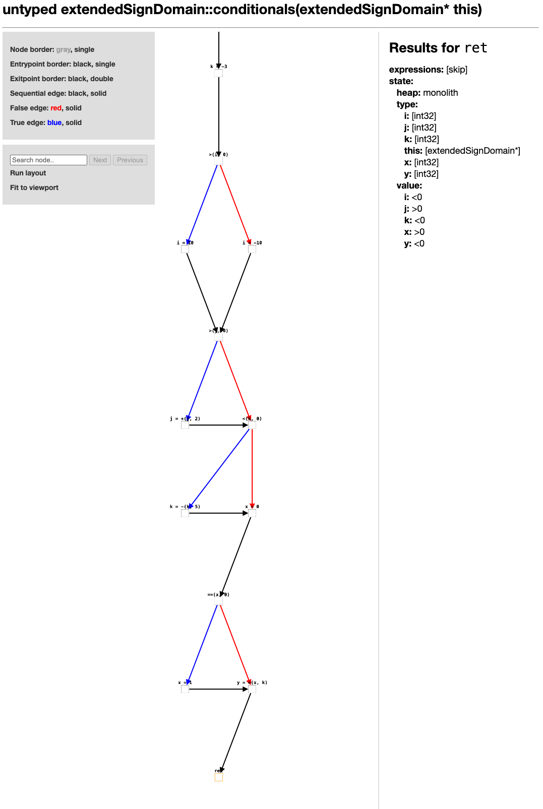
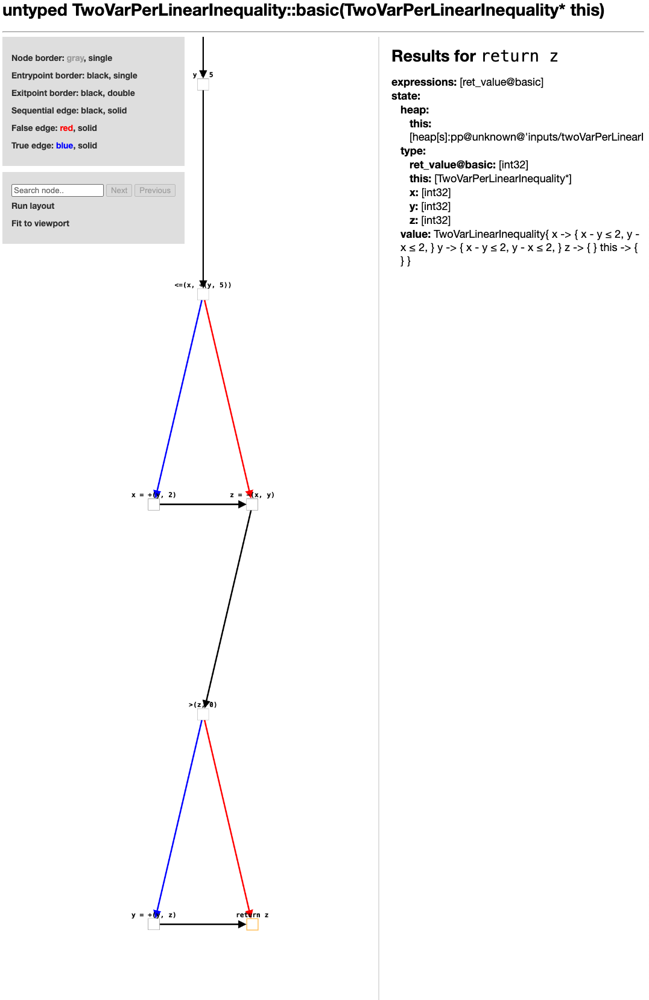
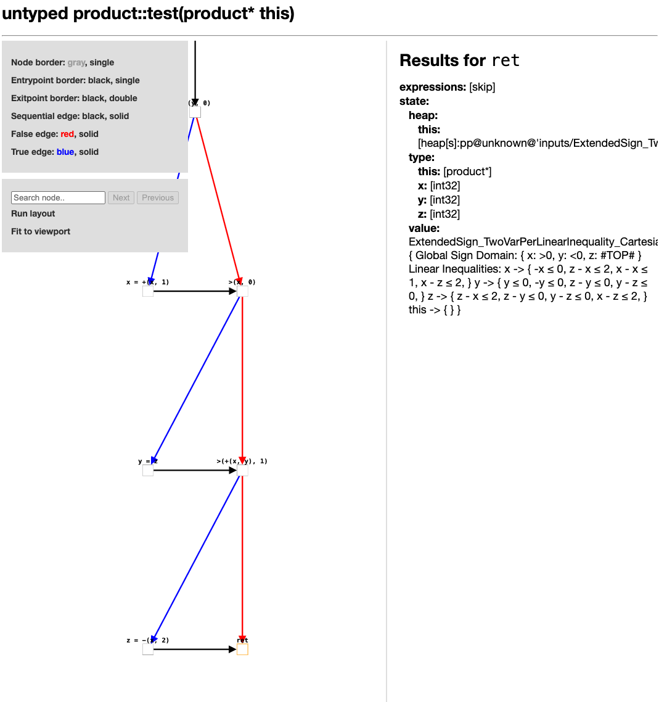

# Binome:
- Ghita Mikou
- Zhengdao Yu

# Sujets Implementes:
## Main:
- Non relationnels: Extended Sign Domain
- Relationnels: Two Var Per Linear Inequality
- Cartesien Produit: Extended Sign Domain*Two Var Per Linear Inequality

## Test:
- TwoVarPerLinearInequalityTest
- ExtendedSignDomainTest
- ExtendedSignDomain_TwoVarPerLinearInequalityTest

# Introduction du projet

Ce projet utilise le cadre d'analyse statique LiSA (Library for Static Analysis) pour implémenter des domaines abstraits et effectuer une analyse statique des programmes écrits dans le langage IMP simple. 
Ce projet a mis en œuvre trois domaines abstraits :

- **Domaine des signes étendus (Extended Sign Domain)** : un domaine numérique non relationnel utilisé pour suivre les informations de signe des variables (positif, négatif, zéro, >=0, <=0.etc.).
- **Domaine des inégalités linéaires à deux variables (Two Variable per Linear Inequality Domain)** : un domaine relationnel qui utilise des inégalités linéaires impliquant deux variables (sous la forme a·x + b·y ≤ c) pour représenter les relations entre les variables.
- **Domaine du produit cartésien (Cartesian Product Domain)** : un domaine produit qui combine les deux domaines ci-dessus tout en maintenant à la fois l'information des signes et des relations pour obtenir des résultats d'analyse plus précis.


## Extended Sign Domain

Le domaine des signes étendus est un domaine abstrait non relationnel conçu pour représenter une gamme approximative des signes des valeurs de chaque variable. 
Contrairement au simple domaine des signes (qui distingue seulement positif, négatif et zéro), le domaine des signes étendus introduit des catégories supplémentaires de signes pour une distinction plus fine lors de la fusion des branches. 
Ce domaine comprend les valeurs abstraites suivantes : 
- valeur positive (POS), 
- valeur négative (NEG), 
- valeur zéro (ZERO), 
- non négative (NON_NEG, zéro ou positif), 
- non positive (NON_POS, zéro ou négatif), 
- non zéro (NON_ZERO, positif ou négatif), 
- ainsi que l'élément supérieur Top représentant n'importe quel signe, et l'élément inférieur Bottom représentant un état impossible.

En ce qui concerne ce domaine non relationnel, notre implémentation reste relativement simple par rapport à la version de base. Il suffit d’adapter le traitement des signes en fonction des différents cas.

Notre approche suit précisément la partie correspondante décrite dans l’article.


## Domaine des inégalités linéaires à deux variables (Two-Variable per Linear Inequality Domain)

Le domaine des inégalités linéaires à deux variables est un domaine abstrait relationnel qui peut représenter des contraintes linéaires sous la forme 

__a·x + b·y ≤ c__ 

(où x, y sont des variables, et a, b, c sont des constantes). 
Ce domaine, également connu sous le nom de domaine TVPI, est un domaine relationnel faible capable de capturer des relations linéaires entre deux variables, offrant ainsi une précision supérieure à celle d'une analyse purement indépendante.

L’implémentation du domaine Two-Variable per Linear Inequality suit dans l’ensemble les principes décrits dans l’article de référence.

Notamment, pour préserver la structure de mapping évoquée dans la publication, 
nous avons introduit une sous-classe dédiée aux inégalités linéaires individuelles dans 
notre conception de classe.(by public class TwoVarLinearInequality extends FunctionalLattice)


```aiignore
 public static class LinearInequality {
        private final Identifier var1; // var: X
        private final double coeff1;   // coeff: a
        private final Identifier var2; // var: Y
        private final double coeff2;   // coeff: b
        private final double constant; // constant: c
```


Quant à l’implémentation du closure, notre approche suit l’idée définie dans la définition 10 de l’article.

L’essentiel de cette logique se trouve dans la méthode result(), dont l’objectif principal est de réaliser l’opération de fermeture (closure), en déduisant de nouvelles informations à l’intérieur de l’ensemble clos.


## Domaine du produit cartésien (Cartesian Product Domain)

Le domaine du produit cartésien combine 2 domaines abstraits pour obtenir des résultats d'analyse plus précis. 
Dans ce projet, nous avons construit le produit cartésien du domaine des signes étendus et du domaine des inégalités linéaires à deux variables, 
ce qui permet de suivre à la fois les informations de signe des variables et les relations linéaires.

### Tests de programmes IMP

Nous avons conçu des tests sur des programmes simples en langage IMP pour évaluer l'implémentation de ces trois domaines abstraits. Ces tests visent à couvrir les structures typiques telles que les branches et les boucles, pour vérifier la capacité des domaines à exprimer les informations de signe et de relation, et pour comparer leur précision.

# Analyse de resultats
### Analyse de resultats pour Extended Sign Domain
#### Basic
```aiignore
 basic() {
        def i = 2;       // i (POS)
        def j = -10;     // j (NEG)
        def z = 0;       // z (ZERO)

        // add
        def a1 = i + j;  // POS + NEG = TOP
        def a2 = i + z;  // POS + ZERO = POS
        def a3 = j + z;  // NEG + ZERO = NEG

        // sub
        def s1 = i - j;  // POS - NEG = POS
        def s2 = j - i;  // NEG - POS = NEG
        def s3 = z - i;  // ZERO - POS = NEG
        def s4 = z - j;  // ZERO - NEG = POS

        // mul
        def m1 = i * j;  // POS * NEG = NEG
        def m2 = j * i;  // NEG * POS = NEG
        def m3 = i * z;  // POS * ZERO = ZERO
        def m4 = j * z;  // NEG * ZERO = ZERO

        // div
        def d1 = i / j;  // POS / NEG = NEG
        def d2 = j / i;  // NEG / POS = NEG
    }
```
On peut constater que l’exécution du programme basic correspond parfaitement à nos attentes, 
lesquelles sont déjà définies dans les commentaires.


#### LOOP
```
// loop + refinement
    whileLoop(a) {
        def x = 0;       // x ZERO
        while(x < a)     // x < a
            x = x + 1;   //then etat de sortie :  x >= 0
    }
```
Ici, on peut voir qu’à travers une boucle répétée, la variable x atteint finalement un état où x ≥ 0. Quant à a, comme on ne connaît pas sa valeur exacte, elle est considérée comme Top. Le résultat du test correspond donc à nos attentes.


#### Condition
```aiignore
  conditionals() {
        def i = 0;       // i ZERO
        def j = 5;       // j POS
        def k = -3;      // k NEG

        if(i > 0) {      // false (ZERO > POS)
            i = 10;
        } else {
            i = -10;     // i = NEG
        }

        if(j > 0) {      // true  (POS > ZERO)
            j = j * 2;   // j == POS
        }

        if(k < 0) {      // true (NEG < ZERO)
            k = k - 5;   // k == NEG
        }

        def x = 0;       // x ZERO
        if(x == 0) {     // true
            x = 1;       // x == POS
        }

        def y = x * k;   // POS * NEG = NEG
    }
```
Ici, lors du test des conditions, après différents blocs if, l’état final de la variable ret correspond également à l’état attendu (en termes de sign) tel que défini dans le code. Ainsi, cette vérification a également été réussie.


### Analyse de resultats pour Two variables per linear inequality
#### Basic
```aiignore
 basic() {
        def x = 10;
        def y = 5;

        //instantiate des inequality
        if (x <= y + 5) {  //  x ≤ y + 5
            x = y + 2;     //  x = y + 2， = x ≤ y + 2 = y ≤ x - 2
        }

        def z = x - y;     //  z = x - y

        if (z > 0) {       //  z > 0
            y = y + z;     //  y = y + z
        }
        
        return z;
    }
```


| Position               | resultat |
|------------------------|------|
| if(x <= y+5) x = y + 2 |  x -> { x - y ≤ 2, y - x ≤ 2, } y -> { x - y ≤ 2, y - x ≤ 2, } |
| if (z > 0) else        |  z -> { -z ≤ 0, }    |

On peut constater que le résultat global est conforme à nos attentes.
Par exemple, dans le cas d’une condition if z > 0, si l’on se situe à l’extérieur de ce bloc conditionnel, cela signifie que l’on est dans le cas contraire, soit z ≤ 0. Ainsi, notre code construit bien la contrainte suivante :

z → { -z ≤ 0 }.

De même, pour une affectation telle que x = y + 2, notre code génère les contraintes suivantes :

x → { x - y ≤ 2, y - x ≤ 2 },
y → { x - y ≤ 2, y - x ≤ 2 }.

### Analyse de resultats pour Cartesian Product
```aiignore
class product {
    test() {
        def x = 10;    // - ExtendedSign: POS
        def y = 0;     // - ExtendedSign: ZERO
        def z = -5;    //  - ExtendedSign: NEG

        // extendedSignDomain
        if (y == 0) {  // ==0
            x = x + 1; // x > 0
        }

        if (x > 0) {   // >0
            y = z;     // y < 0  z < 0
                       // : y < 0, z < 0, y = z
        }

        // TwoVarPerLinearInequality
        if (x + y > 1) {  // inequality
            z = x + 2;         
        }

    }
}
```


| Position               | resultat |
|------------------------|------|
| if (y == 0) { | { Global Sign Domain: { x: >0, y: 0, z: <0 } Linear Inequalities: this -> { } } |
| if (x + y > 1) {  z = x - 2;        |  ExtendedSign_TwoVarPerLinearInequality_Cartesian { Global Sign Domain: { x: >0, y: <0, z: #TOP# } Linear Inequalities: x -> { z - x ≤ 2, x - z ≤ 2, } y -> { y ≤ 0, -y ≤ 0, } z -> { z - x ≤ 2, x - z ≤ 2, } this -> { } }   |

Ici, on peut constater que nous avons réussi à maintenir séparément l’environnement du domaine des signes étendu (Extended Sign Domain) ainsi que l’état du domaine Two Variables per Linear Inequality.

Dès l’initialisation, les états de x, y et z au niveau du domaine des signes sont conformes à nos attentes :

x : > 0, y : = 0, z : < 0.

Ensuite, lors de l’entrée dans le bloc if (x + y > 1) { z = x - 2; } (une inégalité), 
nous avons également réussi à analyser correctement la contrainte 

z - x ≤ 2.


# LiSA tutorials

This repository contains the code developed and used during LiSA's tutorials. Every tutorial is listed together with a link to the slides used and the tag of the code shown during the tutorial itself.

## Tutorials given

- PLDI '24 [[slides]](https://docs.google.com/presentation/d/1-oFl5Lgg-6mu0IdXMv8u-9w_ypc1aYbg-t_t8HVQBjw/edit?usp=sharing) [[code used]](https://github.com/lisa-analyzer/lisa-tutorial/releases/tag/pldi24)

- Lipari Summer School '24 [[slides]](https://docs.google.com/presentation/d/16MYOHTZJuuzuym9tcIH4L2r24Kn11vjAq7vpyTGcv14/edit?usp=sharing) [[code used]](https://github.com/lisa-analyzer/lisa-tutorial/releases/tag/lipari24)

- Ca' Foscari PhD Course - [[code used]](https://github.com/lisa-analyzer/lisa-tutorial/releases/tag/ssv24)

- Seminar at University of Verona - [[code used]](https://github.com/lisa-analyzer/lisa-tutorial/releases/tag/univr25)
